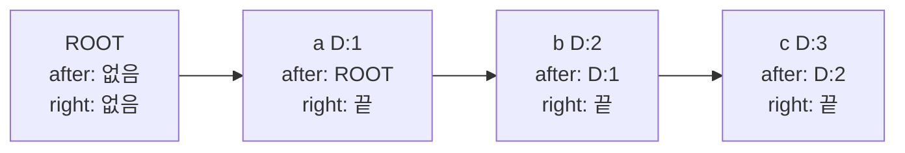
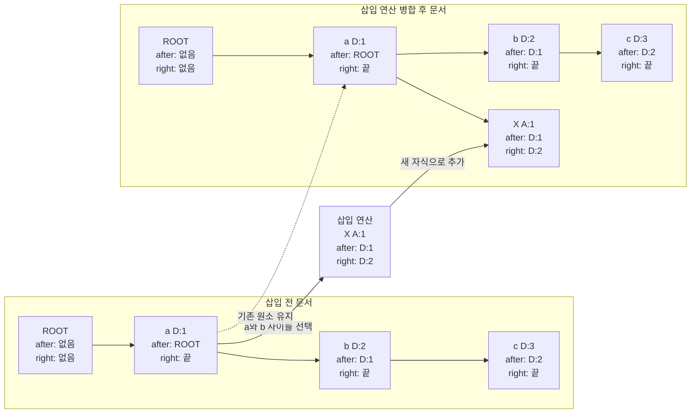
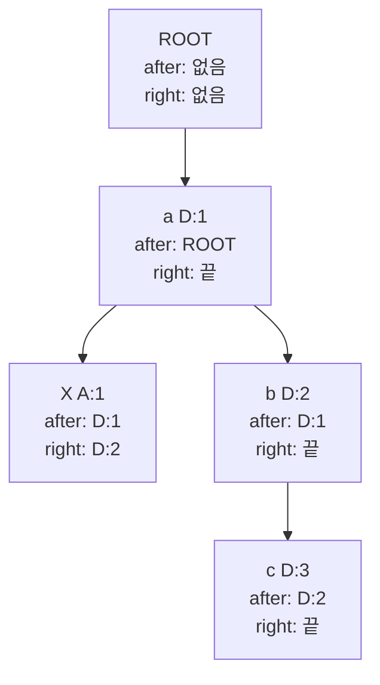
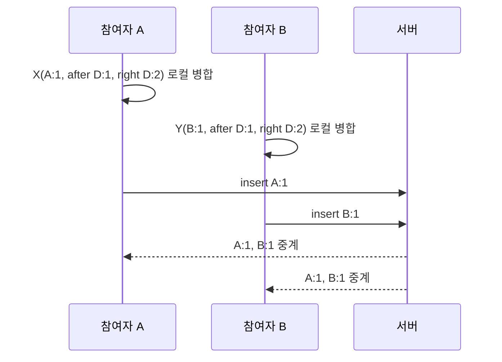
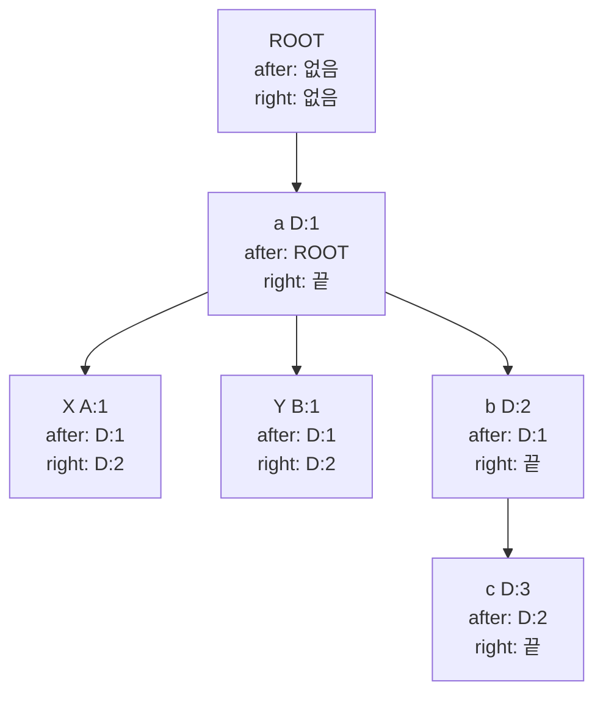
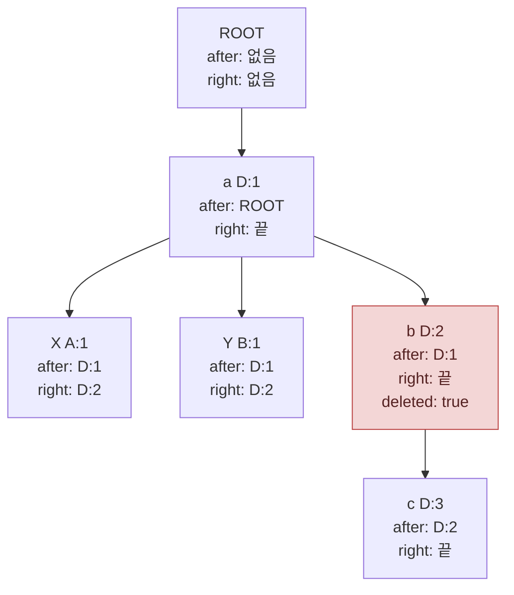
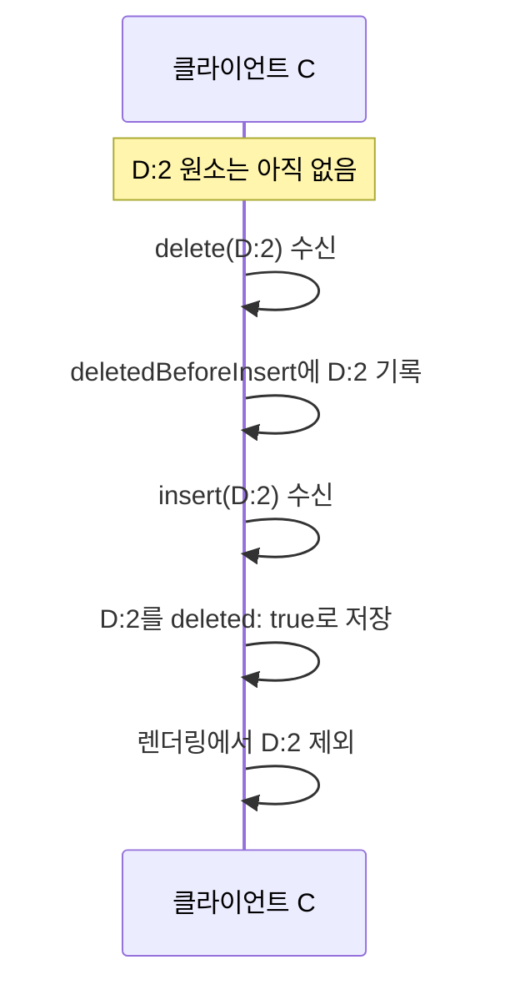
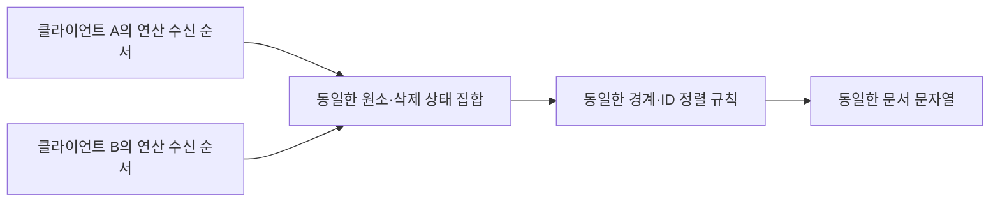

# CRDT 단계별 동작

이 문서는 현재 CRDT 데모의 구현을 기준으로, 문자 원소가 생성되고 병합·삭제·정렬되는 과정을 순서대로 설명합니다. 색상 정보는 문서 동기화 규칙과 관계없으므로 생략합니다.

## ID 표기법

이 문서에서 `A:1`, `D:2` 같은 표기는 **문자 원소 ID**를 짧게 쓴 것입니다. 콜론 앞의 문자는 원소를 만든 클라이언트를 나타내는 예시용 구분자이고, 콜론 뒤 숫자는 그 클라이언트가 만든 원소의 순번입니다.

| 표기 | 뜻 |
| --- | --- |
| `A:1` | 참여자 A가 만든 첫 번째 문자 원소 |
| `D:2` | 참여자 D가 만든 두 번째 문자 원소 |

따라서 `a D:1`은 문자 내용이 `a`이고, 그 문자를 식별하는 ID가 `D:1`이라는 뜻입니다. 실제 코드에서는 `A`나 `D` 대신 각 브라우저가 만든 UUID를 사용하며, 구조는 `clientId:counter`입니다. 문자 내용이 같아도 원소 ID는 항상 다릅니다.

## 1. 문서는 문자열이 아니라 문자 원소의 관계로 저장한다

각 문자는 고유한 `id`를 가집니다. `after`는 삽입 시점의 앞 경계 원소 ID이고, `right`는 삽입 시점의 뒤 경계 원소 ID입니다. `ROOT`는 실제 문자가 아닌 문서의 시작을 나타내는 기준 원소입니다.

화면에는 관계를 따라 `a`, `b`, `c`를 순서대로 표시합니다. 따라서 `aaa`는 세 개의 서로 다른 원소입니다.

## 2. 삽입으로 원소 관계가 변한다

참여자 A가 `a`와 `b` 사이에 `X`를 삽입하면, 클라이언트는 커서 위치를 앞 원소 `D:1`과 뒤 원소 `D:2`로 바꿉니다. 새 문자 원소에는 `id: A:1`, `after: D:1`, `right: D:2`가 기록됩니다. 아래 그림은 삽입 전 관계에서 이 원소가 병합된 뒤의 관계로 바뀌는 과정입니다.

삽입 뒤에는 `a`의 자식이 두 개가 됩니다. 기존 `b`와 새 `X`가 모두 `after: D:1`을 가지기 때문입니다. 다만 `X`는 `right: D:2`를 가지므로 `b`보다 앞에 배치됩니다. 삽입 연산에는 `position: 1` 같은 숫자 위치가 아니라, 새 원소의 ID와 양쪽 경계 관계가 들어갑니다.

## 3. 오른쪽 경계가 먼저 위치를 결정한다

2단계의 병합 결과에서 `X`와 `b`는 모두 `a`의 자식입니다. `X`의 `right`가 `b`를 가리키므로 `X`는 `b`보다 앞에 배치됩니다.

따라서 표시 순서는 `aXbc`가 됩니다. `X`와 다른 참여자의 새 원소가 모두 `after: D:1`, `right: D:2`를 공유하는 경우에만 그 원소들끼리 ID를 정렬합니다. 서버 도착 순서는 이 규칙에 사용하지 않습니다.

## 4. 다른 참여자가 같은 기준 원소 뒤에 동시에 삽입할 수 있다

참여자 B도 서버의 응답을 받기 전에 같은 구간인 `a`와 `b` 사이에 `Y`를 삽입할 수 있습니다. B의 연산도 `after: D:1`, `right: D:2`를 사용하지만, 새 원소 ID는 A의 것과 다릅니다.

서버는 두 삽입 연산을 변환하지 않습니다. 각 클라이언트는 두 원소를 `D:1`의 자식이면서 `D:2`보다 앞인 원소로 병합합니다.

`X`와 `Y`는 같은 양쪽 경계를 공유하므로 두 원소의 ID를 정렬합니다. 여기서는 `A:1`이 `B:1`보다 앞이므로 모든 클라이언트는 `aXYbc`를 계산합니다. 특정 클라이언트가 A의 연산을 먼저 받았는지 B의 연산을 먼저 받았는지는 최종 순서에 영향을 주지 않습니다.

## 5. 타인의 연산도 로컬 연산과 같은 방식으로 병합한다

클라이언트는 직접 만든 연산을 즉시 `integrate`하고, 서버에서 수신한 연산도 동일한 `integrate` 함수로 처리합니다. 연산 ID가 이미 처리된 경우에는 다시 적용하지 않습니다.

그래서 자기 연산이 서버를 거쳐 다시 돌아와도 중복 적용되지 않습니다.

## 6. 삭제는 원소를 제거하지 않고 tombstone을 남긴다

참여자 B가 원래의 `b`를 삭제하면, 삭제 연산은 문자 내용이나 숫자 위치가 아니라 `D:2`를 대상으로 합니다. 클라이언트는 `D:2` 원소를 자료 구조에서 지우지 않고 `deleted: true`로 표시합니다.

렌더링할 때 `D:2`는 건너뛰지만, `D:2` 아래의 `c`까지 건너뛰지는 않습니다. 따라서 표시 문자열은 `aXYc`가 됩니다. 삭제된 원소를 남겨야 이후 연산이 참조하는 관계를 유지할 수 있습니다.

## 7. 삭제가 삽입보다 먼저 적용돼도 삭제 상태를 보존한다

현재 클라이언트는 아직 없는 원소의 삭제 ID를 `deletedBeforeInsert`에 보관합니다. 나중에 해당 원소가 도착하면 처음부터 `deleted: true`인 원소로 추가합니다.

이 처리는 연산 적용 순서가 달라져도 삭제 사실이 사라지지 않게 합니다.

## 8. 최종적으로 모든 복제본이 같아지는 조건

모든 클라이언트가 같은 연산 집합을 받으면, 다음 규칙을 동일하게 적용합니다.

1. 원소 ID가 같은 삽입 연산은 한 번만 병합합니다.
2. 삭제 연산은 지정된 원소 ID에 tombstone을 남깁니다.
3. `right` 경계가 가리키는 원소보다 앞에 배치하고, 같은 양쪽 경계를 공유하는 동시 삽입만 ID 순서로 정렬합니다.
4. 삭제되지 않은 원소만 화면에 표시합니다.

이것이 현재 구현에서 OT의 위치 변환 없이도 최종 문서 순서를 맞추는 핵심입니다.
