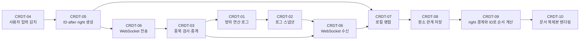

# CRDT 실시간 공동 편집 데모

문자를 위치가 아닌 고유 ID와 양쪽 경계 원소(`after`, `right`)로 표현하는 간단한 RGA 계열 CRDT 데모입니다. 서버는 연산을 저장·중계하고 브라우저는 연산을 병합해 문서를 구성합니다.

## 실행

```powershell
npm install
npm start
```

브라우저에서 `http://localhost:3000?room=발표방이름`을 열고 같은 주소를 여러 창에서 엽니다. 같은 방 이름은 같은 연산 로그를 공유합니다.

## 온라인 발표 배포

이 폴더를 Render의 **Web Service**로 연결합니다.

| 설정          | 값            |
| ------------- | ------------- |
| Runtime       | Node          |
| Build Command | `npm install` |
| Start Command | `npm start`   |

`PORT`는 배포 플랫폼이 주입한 값을 자동 사용합니다. 서버 메모리는 실행 중에만 유지되므로, 발표 전에 새 방 이름을 사용하면 빈 연산 로그에서 시작합니다.

## 라벨별 동작 방식

아래 순서는 코드 주석의 `[CRDT-01]`부터 `[CRDT-10]`까지와 같습니다. 이 절은 특정 문자열이나 숫자를 사용한 사례 없이 처리 구조만 설명합니다.

### CRDT-01 · 서버 방 상태

서버는 방마다 현재 텍스트를 저장하지 않습니다. 대신 수신한 삽입·삭제 연산 목록, 중복 수신을 막기 위한 연산 ID 집합, 연결된 소켓 집합을 보관합니다.

### CRDT-02 · 연산 로그 스냅샷

새 참여자가 접속하면 서버는 누적된 연산 목록 전체를 전달합니다. 클라이언트는 이 목록을 병합해 자신의 문서 복제본을 구성합니다.

### CRDT-03 · 연산 중계

서버는 연산 내용을 다른 연산에 맞춰 변환하지 않습니다. 연산 ID가 이미 처리됐는지만 검사하고, 새 연산에 서버 시각을 기록한 뒤 방의 모든 참여자에게 중계합니다.

### CRDT-04 · 사용자 입력 감지

클라이언트는 입력 전후 텍스트를 비교해 달라진 위치와 삭제된 내용, 추가된 내용을 계산합니다. 이 결과를 바탕으로 삽입 또는 삭제 연산 생성을 시작합니다.

### CRDT-05 · 연산 생성

삽입은 숫자 위치를 앞 원소 ID인 `after`와 뒤 원소 ID인 `right`로 바꾸고, 새 문자마다 고유 ID와 양쪽 경계 관계를 생성합니다. 삭제는 숫자 범위 대신 현재 범위에 해당하는 원소 ID 목록을 생성합니다. 전송되는 연산은 위치가 아닌 이 ID와 관계를 포함합니다.

### CRDT-06 · WebSocket 전송과 수신

클라이언트는 로컬에서 만든 연산을 먼저 병합한 뒤 WebSocket으로 서버에 전송합니다. 접속 시 받은 누적 연산 로그와 접속 후 중계되는 연산도 WebSocket으로 수신해 같은 병합 경로로 처리합니다.

### CRDT-07 · 연산 병합과 삭제 표식

삽입 연산은 새 원소를 자료 구조에 연결합니다. 삭제 연산은 대상 원소를 자료 구조에서 제거하지 않고 `deleted` 상태로 표시합니다. 렌더링 시 삭제 표식이 있는 원소는 보이지 않지만, 병합 정보에는 남아 있습니다.

### CRDT-08 · 원소 관계 저장

클라이언트는 삽입된 문자를 고유 ID를 가진 원소로 저장합니다. 각 원소는 삽입 시점의 앞 경계 `after`와 뒤 경계 `right`를 기록합니다. 삭제가 먼저 도착한 경우도 처리할 수 있도록 미리 받은 삭제 ID를 별도로 보관합니다.

### CRDT-09 · 순서 계산

클라이언트는 `right` 경계가 가리키는 원소보다 앞에 새 원소를 배치합니다. 같은 `after`와 `right` 경계를 공유하는 동시 삽입만 ID로 정렬합니다. 같은 원소 집합을 가진 모든 클라이언트가 같은 규칙을 적용하므로 표시할 문자 순서가 일치합니다.

### CRDT-10 · 문서 복제본 렌더링

클라이언트는 정렬된 원소 중 삭제 표식이 없는 원소만 이어 붙여 문서 문자열과 색상 레이어를 렌더링합니다. 화면의 시간과 로그 시간은 각각 현재 시각과 연산이 서버에 기록된 시각을 표시합니다.

### 라벨 흐름도


